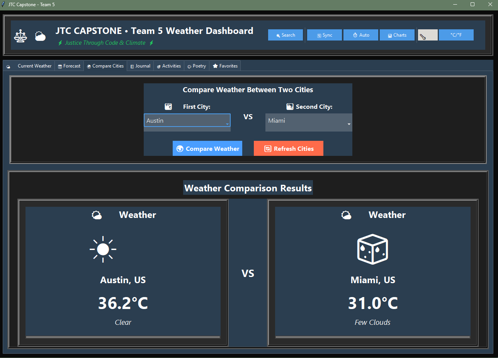
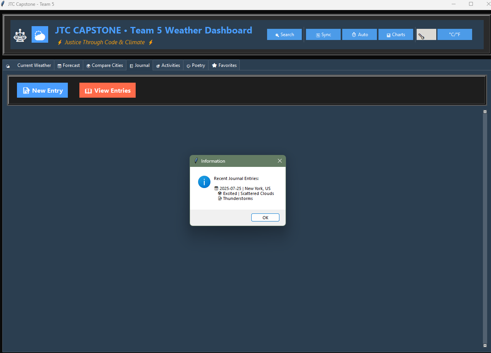
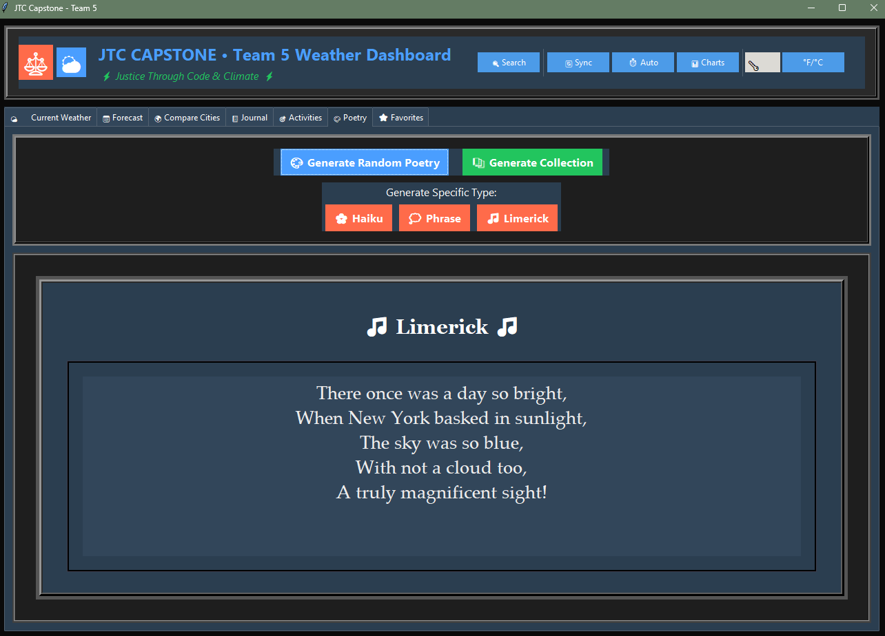

# Week 15 Milestone Reflection

## GitHub Repository

- **Primary Repo:** [Weather Dashboard GitHub Repo](https://github.com/StrayDogSyn/weather_dashboard_E_Hunter_Petross)
- **Team Data Repo:** [New Team Dashboard](https://github.com/StrayDogSyn/New_Team_Dashboard)
- Recent development is on the `week15_advanced_implementations` branch. Please refer to July 2025 commits for the latest progress on Features 2, 3, and the personal enhancement.

## Demonstration of Features 2 and 3

### Feature 2: City Comparison

- **Status:** Fully implemented
- **Description:** Users can select any two cities to compare real-time weather data, including temperature, humidity, wind speed, and visual charts. Data is dynamically loaded from the capstone team repository for accuracy and collaboration.
- **Screenshot:**
  - 

### Feature 3: Weather Journal

- **Status:** Fully implemented
- **Description:** Users can log daily weather and mood entries, review their history, and export journal data for further analysis or sharing. The journal supports both text and visual summaries.
- **Screenshot:**
  - 

## Personal Enhancement Progress

- **Enhancement:** Advanced UI with glassmorphic design and interactive analytics dashboard
- **Progress:** Approximately 60% complete. The UI framework has been modernized for a contemporary look and feel, and the analytics dashboard now supports dynamic charts and improved accessibility. See commits tagged `feat: advanced UI` and `feat: dashboard analytics` for technical details.
- **Additional Feature Preview:**
  - 

## Status Update

Feature 2 (City Comparison) and Feature 3 (Weather Journal) are fully implemented and integrated into the application. The personal enhancement—an advanced glassmorphic UI and analytics dashboard—is over halfway finished, with all major components functional and ongoing work focused on visual polish and user experience. There are currently no significant blockers; the remaining tasks include refining chart interactivity and enhancing accessibility. Feedback on UI clarity, dashboard usability, or any other aspect is welcome as I work toward final completion next week.
